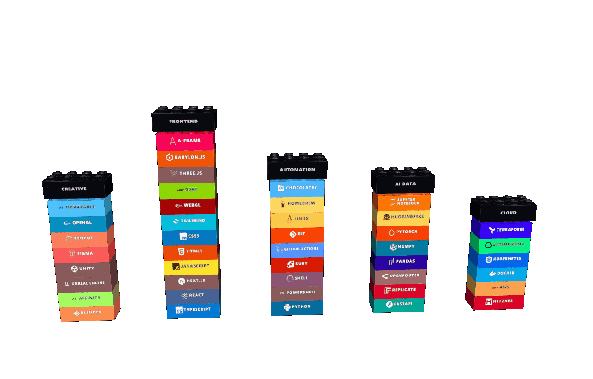

# LEGO Tech Stack

Make a LEGO-style tech stack image for your GitHub profile README.

<p align="center">
  
</p>
<p align="center">
  <sub><a href="./output/lego-techstack.png">View PNG</a></sub>
</p>

## What You Will Use

- `output/lego-techstack.png`: the main image for your README
- `output/lego-techstack-disassemble.gif`: optional animation link

## How To Use It

### 1. Fork this repo

Fork this repository to your own GitHub account.

### 2. Clone your fork

```sh
git clone https://github.com/<your-user>/lego-techstack.git
cd lego-techstack
```

### 3. Install dependencies

```sh
npm install
```

### 4. Start the local editor

```sh
npm run preview
```

Then open `http://localhost:4173/`.

### 5. Edit your stack on localhost

Use the browser editor to:

- rename categories and bricks
- change brick colors
- reorder stacks and bricks
- upload SVG logos if you want custom icons

When you are done, click either:

- `Copy JSON`
- `Download JSON`

### 6. Save the exported JSON

Replace the contents of `data/techstack.json` with the JSON from the localhost editor.

If you prefer editing by hand, you can still edit `data/techstack.json` directly.

The two fields most people need for each brick are:

- `label`: the text shown on the brick
- `color`: the brick color

Example:

```json
{
  "title": "Your Name LEGO Tech Stack",
  "categories": [
    {
      "category": "Frontend & Web",
      "capLabel": "Frontend",
      "capColor": "#2563eb",
      "items": [
        { "label": "React", "color": "#20232a" },
        { "label": "Next.js", "color": "#000000" },
        { "label": "Tailwind CSS", "color": "#06b6d4" }
      ]
    },
    {
      "category": "Backend",
      "capLabel": "Backend",
      "capColor": "#16a34a",
      "items": [
        { "label": "Node.js", "color": "#3c873a" },
        { "label": "PostgreSQL", "color": "#336791" }
      ]
    }
  ]
}
```

### 7. Generate the images

```sh
npm run gif
```

This creates:

- `output/lego-techstack.png`
- `output/lego-techstack-disassemble.gif`

### 8. Commit and push your changes

```sh
git add data/techstack.json output
git commit -m "Update tech stack"
git push
```

### 9. Paste this into your GitHub profile README

Paste this into the `README.md` of your GitHub profile repository, which is usually named `<your-user>/<your-user>`.

Replace `<your-user>` with your GitHub username.

```md
<p align="center">
  /lego-techstack/main/output/lego-techstack-disassemble.gif"
  />
</p>
<p align="center">
  <sub>
    <a href="https://raw.githubusercontent.com/<your-user>/lego-techstack/main/output/lego-techstack.png">
      View Static
    </a>
  </sub>
</p>
```

If your default branch is not `main`, change that part of the URL too.
If you renamed this fork, replace `lego-techstack` in the URL with your repo name.

## Troubleshooting

- If a logo does not appear, the generator will use letters instead.
- If the image in your GitHub README does not update right away, wait a bit and refresh the page.
